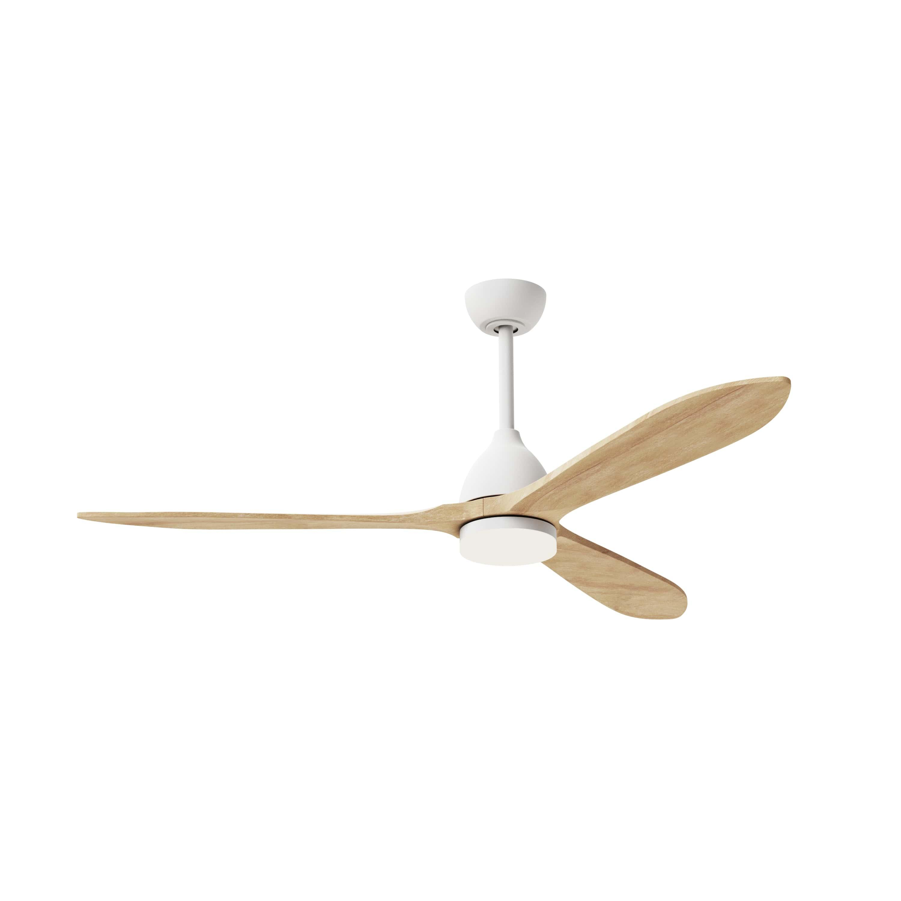
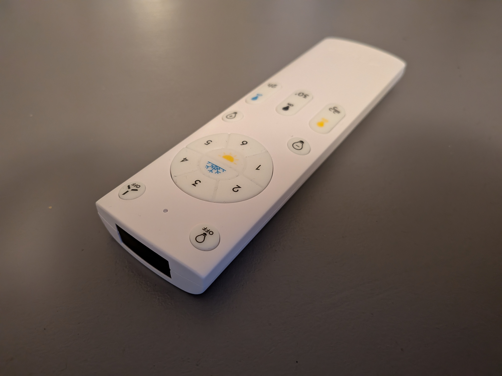
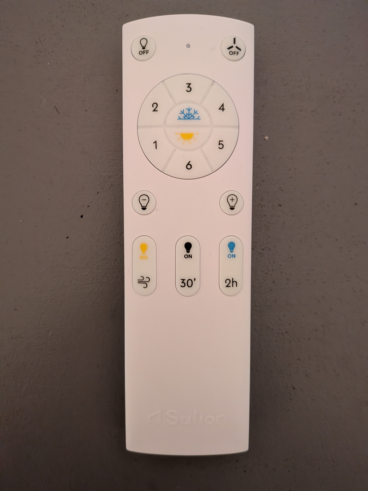
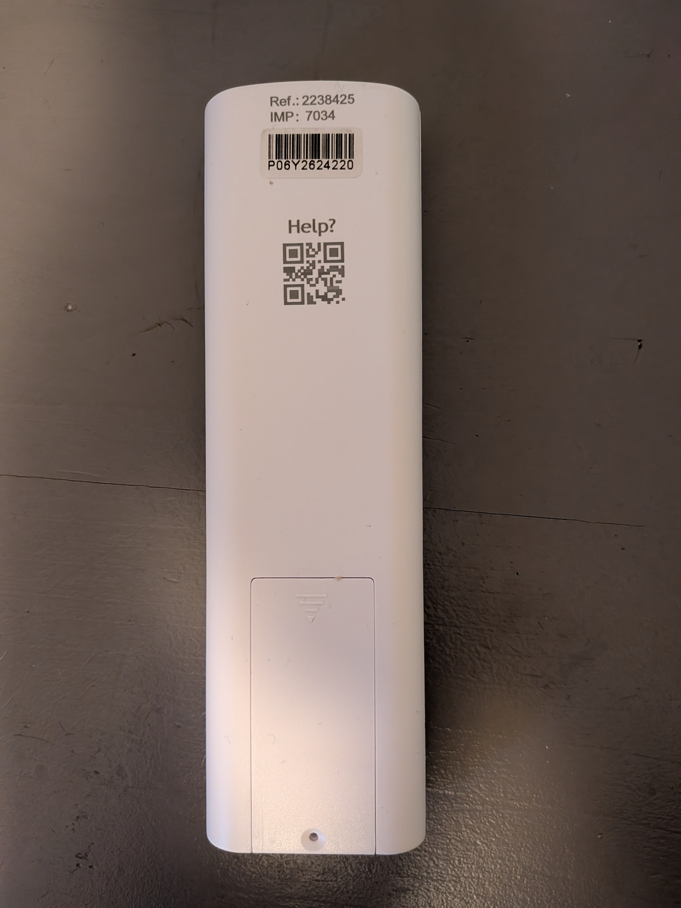
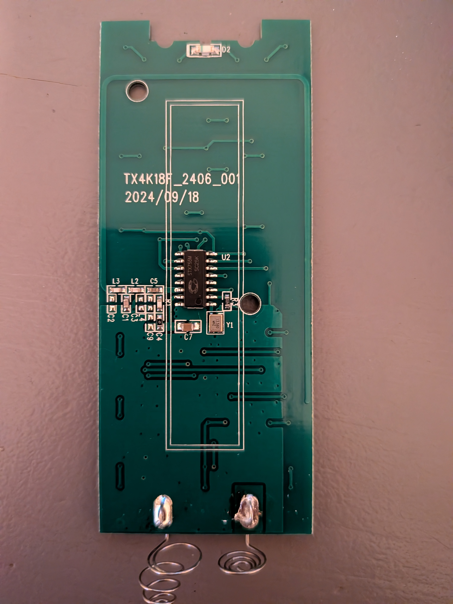
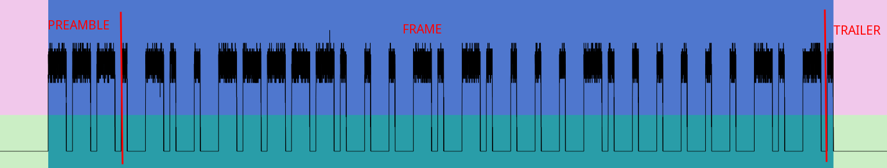
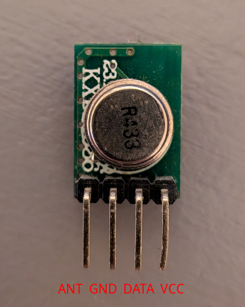

# Sulion 433MHz protocol

This small repository is intended to describe what I discovered about the protocol used by [Sulion ceiling fan](https://sulion.es/56-ventilacion) while trying to control it through domoticz using ESPHome.

The fan looks like this:

It comes with a small remote that looks to be an IR remote:

It is actually a radio remote, there is no IR LED on the PCB:

It has a single chip STX755M ([datasheet](http://radiumcorp.com/data/STX755M.pdf)) which is a 315/433MHz OOK/ASK transmitter with embedded MCU.

Using the great [Universal Radio Hacker](https://github.com/jopohl/urh) tool with RTL-SDR, I sniffed the codes sent by all the buttons. The transmission uses fixed bit-width PWM (Pulse Width Modulation) - 1 is encoded as 750µs high/250µs low while 0 is encoded as 250µs high/750µs low (so each bit is 1ms). The protocol is very simple, each messages consist of

- preamble: first sequence: 250µs high/250µs low / repeat: 3x 750µs high/250µs low
- frame: 29 bits
- trailer: 250µs high

Messages are repeated with a 7.9ms gap between each message.

The demodulated (repeated - long preamble) signal looks like this:

As I have a single remote it is difficult to fully decode the protocol, but from the codes I captured, each frame is composed by:

- Remote ID: 17 bits
- Command code: 5 bits
- Rolling code: 3 bits counter
- Some kind of checksum: 4 bits

I am not really sure about the checksum algorithm, see `rmt433.yaml`.

For my remote, the different command codes are:

| Command      | code  |
|--------------|-------|
| Light off    | 00100 |
| Fan off      | 00010 |
| Speed 1      | 10000 |
| Speed 2      | 10010 |
| Speed 3      | 11100 |
| Speed 4      | 01010 |
| Speed 5      | 01111 |
| Speed 6      | 01100 |
| Cool mode    | 00101 |
| Warm mode    | 00011 |
| Light -      | 10001 |
| Light +      | 01000 |
| Light yellow | 01101 |
| Light grey   | 01110 |
| Light white  | 10011 |
| Wind mode    | 10101 |
| Timer 30m    | 01001 |
| Timer 2h     | 11001 |

Each _short_ key press sends roughly 5 messages.

With all this, it is quite easy to send codes using a `remote_transmitter` with ESPHome. An example can be found in `rmt433.yaml`. It uses a simple 433MHz transmitter like this one (working using 3.3V):

